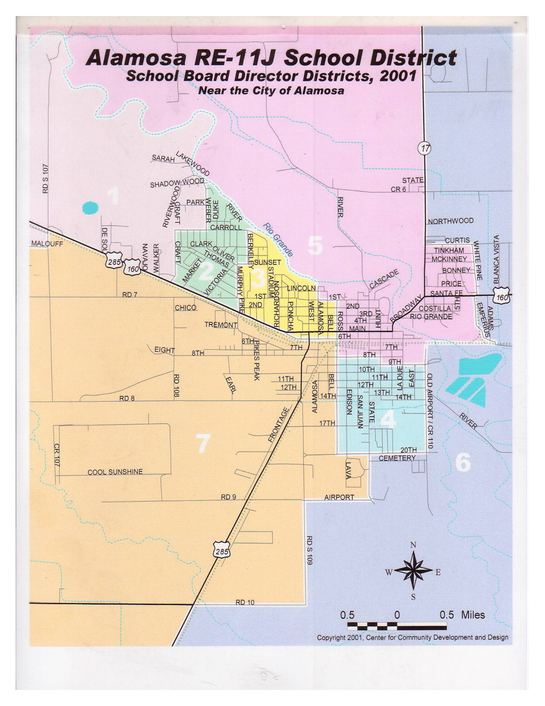
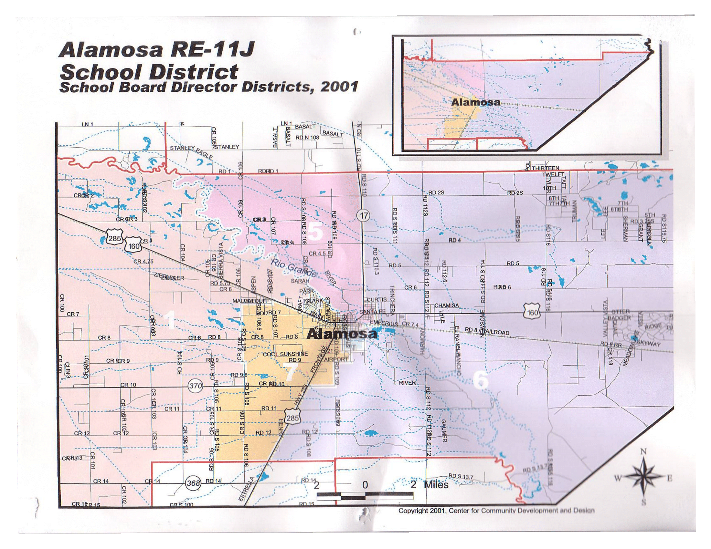
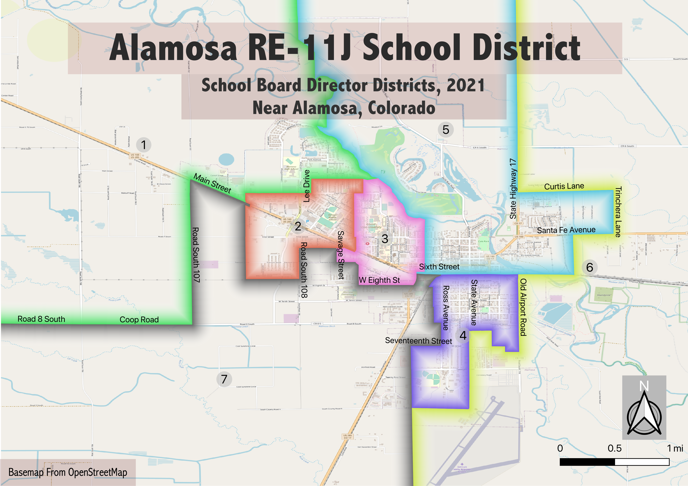
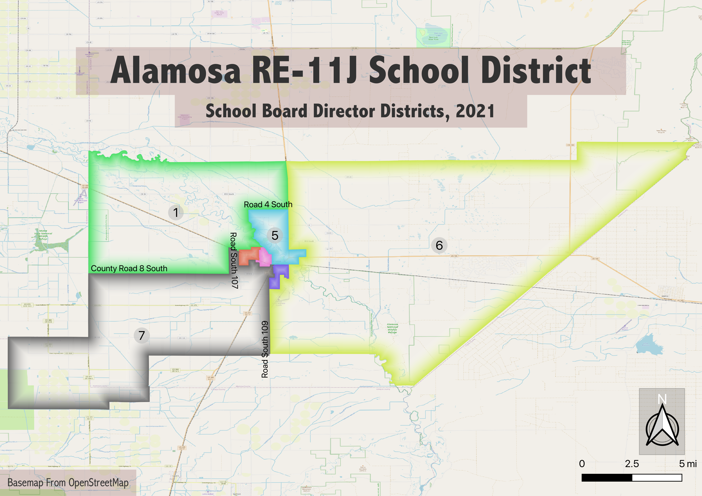

The Alamosa, Colorado RE-11J School District includes most of Alamosa and some of Conejos Counties in Colorado. The Alamosa School Board is elected from 7 director districts delineated from within the larger school district. These exist to ensure the school board is composed of members from different geographic neighborhoods of the town and community. While board members campaign and are represent their director district on the board, all residents of the Alamosa School District vote for all seven members.

As they are representative voting districts, director districts must be redrawn every ten years, following the US Census, to ensure that each has equal population. As of 2019, however, the Alamosa director districts had not been reapportioned since 2001. The images below show the director district maps from 2001.

While they were roughly equal when first drawn, these districts grew unbalanced in the following 20 years, as shown in the table below.

|District|Population 2000|Population 2010|Population 2020|Percent Change|
|One|1918|2069|2650|38.16|
|Two|1943|1708|1580|-18.68|
|Three|1944|1807|1943|-0.05|
|Four|2001|2243|2059|2.90|
|Five|1989|1982|2184|9.80|
|Six|1976|2126|2053|3.90|
|Seven|1947|2380|2855|46.66|
||||||
|Total|13718|14315|15324|11.71|
|Percent Variation|4.37|39.34|80.69||

I worked alongside the Alamosa School District to reapportion its director districts following the 2020 Census. I downloaded census block level population data using the tidycensus package in R-Studio, and drew a preliminary set of maps of director districts with equal population. I then discussed my findings with the board, and we worked conjunctly to create the following districts.

These maps were approved by the Alamosa School District on October 5, 2021 and are now in official use.
