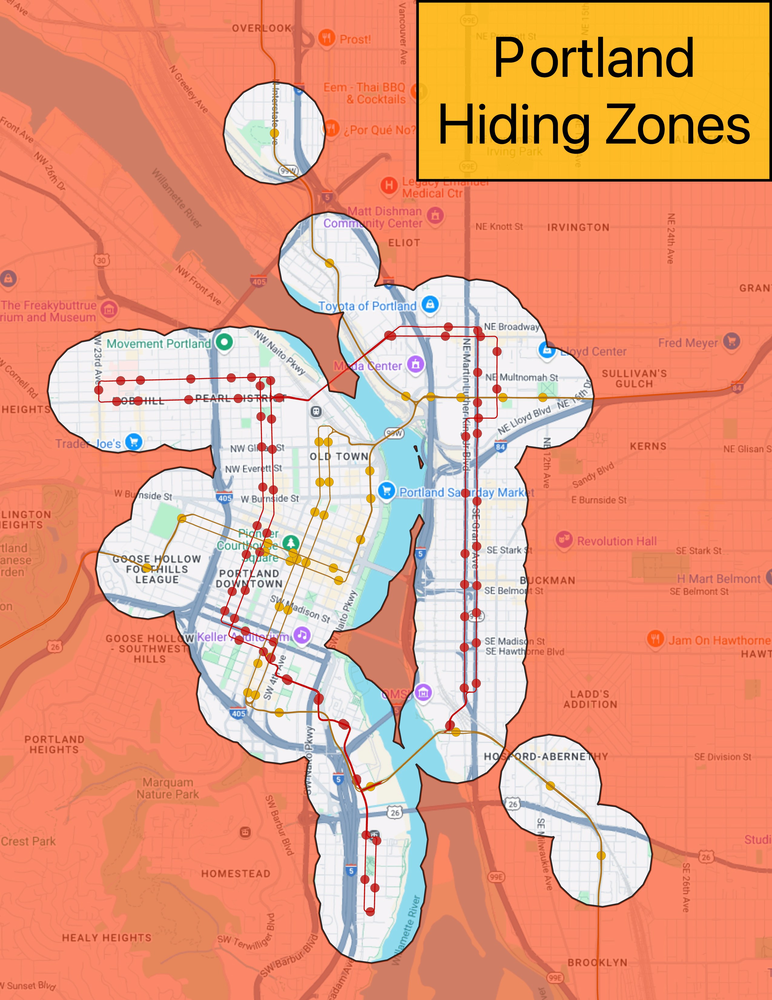

# Mapping Potential Hiding Zones for Jet Lag: The Game, Hide and Seek Transit Game

The YouTube channel [Jet Lag: The Game](https://www.youtube.com/@jetlagthegame) is a travel game show the often involves playing childhood games on the scale of one or several countries based around public transit systems. They recently released a [version of hide and seek](https://store.nebula.tv/collections/jetlag/products/hideandseek) that can be bought by fans to be adapted to any public transit system in the world. For this project, I adapted it to the MAX and Street Car in central Portland, Oregon. We played using the "small game" setting, where hiders and 30 minutes to take transit hide anywhere in the map, but must remain within 0.25 miles of a transit stop, and seekers ask questions to deduce where the hider is located. The map below shows all areas within 0.25 miles of a MAX or Street Car stop in central Portland, and can be used for seekers to help narrow down the potential hiding area. I downloaded the transit lines and stops from OpenStreetMap and used a Google Maps basemap, and assembled the print layout in QGIS.

*Note that the Google Maps basemap was used for convenience (many of the seeking questions require Google Maps), but is public domain.*
