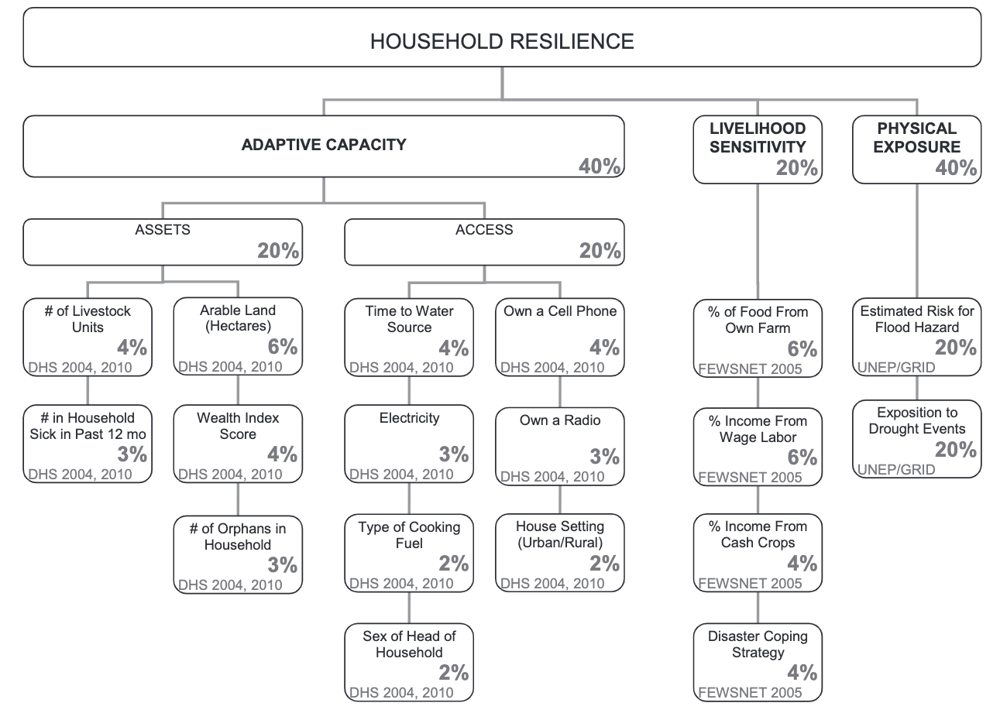

**Replication of**
# Vulnerability modeling for sub-Saharan Africa

Original study *by* Malcomb, D. W., E. A. Weaver, and A. R. Krakowka. 2014. Vulnerability modeling for sub-Saharan Africa: An operationalized approach in Malawi. *Applied Geography* 48:17–30. DOI:[10.1016/j.apgeog.2014.01.004](https://doi.org/10.1016/j.apgeog.2014.01.004)

Replication Authors:
Jackson Mumper, Joseph Holler, Kufre Udoh, Open Source GIScience students of fall 2019 and spring 2021

Replication Materials Available at: [RP-Malcomb](https://github.com/jackson-mumper/RP-Malcomb)

Created: `26 April 2021`
Revised: `4 May 2021`

## Abstract

The original study is a multi-criteria analysis of vulnerability to Climate Change in Malawi, and is one of the earliest sub-national geographic models of climate change vulnerability for an African country. The study aims to be replicable, and had 40 citations in Google Scholar as of April 8, 2021.

## Original Study Information

The study region is the country of Malawi. The spatial support of input data includes DHS survey points, Traditional Authority boundaries, and raster grids of flood risk (0.833 degree resolution) and drought exposure (0.416 degree resolution).

The original study was published without data or code, but has detailed narrative description of the methodology. The methods used are feasible for undergraduate students to implement following completion of one introductory GIS course. The study states that its data is available for replication in 23 African countries. Replication is important as a means of ensuring the efficacy of research findings. It is particularly important for this type of study, where the result is highly variable to a somewhat subject list of inputs.

### Data Description and Variables

The original study compiled data from three sources: Demographic and Health Survey data, Famine Early Warning Network, and UNEP/GRID-Europe. The former data source was used calculate an adaptive capacity score for each of the Traditional Authorities (TAs) in the country based on assets and access variables in the DHS data. Adaptive capacity was both an outcome variable as well as an input variable in the vulnerability calculations, alongside livelihood sensitivity (from FEWSNET data) and physical exposure (from UNEP/GRID data). The full metric used by Malcomb et al to calculate adaptive capacity and household resilience can be found in their original Table 2, listed as Figure 1 below.

Figure 1: Inputs of adaptive capacity (from Malcomb et al, Table 2)

While Malcomb does not explicitly state the exact data variables from which the indicators in Table 2 were found in each dataset, the tend to be easily identifiable for the DHS variables, with names that were often identical to names in the DHS.

The FEWSNET data used to calculate livelihood sensitivity was aggregated based on livelihood zones. This uses only data from the poor wealth group in their spreadsheets. The four variables used to calculate livelihood sensitivity are:
1. The percent of food sources from ones own crops, located once cell beneath 'crops' on the table 'SOURCES OF FOOD' at the bottom of the spreadsheet.
2. The percent found when dividing 'labour etc.' by 'total' from the 'SOURCES OF CASH' table at the bottom of the spreadsheet.
3. The percent of a households' income from the sale of crops, as a ratio of 'crops' to 'total' in the 'SOURCES OF CASH' table. However, it also remained unclear what the definition of a 'cash crop' was, beyond just any crops that were sold.
4. Disaster coping strategy. Malcomb et al make little reference to what this means or how it was calculated beyond that is is the percent of income that would lead to ecological destruction. Our best guess as to what constitutes this was the total income from wood and tobacco related sources under the 'CROP PRODUCTION' table divided by total income at the bottom of the spreadsheet. That said, due to miscommunication within our replication group, there were internal inconsistencies in how this was calculated in addition to inconsistencies from the unclear methodology in Malcomb et al.

Finally, physical exposure was calculated based on a rasterized layer of estimated flood risk and exposure to drought events.

### Analytical Specification

The original study was conducted using ArcGIS and STATA, but does not state which versions of these software were used. The replication study uses R 4.0.5 in R-Studio 1.2.5033.

## Materials and Procedure

The final workflow used in this replication is summarized below. While there is uncertainty as to how closely this matches the workflow of Malcomb et al, this is similar to the narrative workflow outlined in the paper.

1. Download traditional authorities: MWI_adm2.shp
2. Add TA and LZ ids to DHS clusters
3. Remove HH entries with invalid or unknown values
4. Aggregate HH data to DHA clusters, and then joining to traditional authorities to get: ta_capacity_2010
5. Remove index and livestock values that were NA
6. Find sum of livestock by HH
7. Scale adaptive capacity fields (from DHS data) on scale of 1 - 5 to match Malcomb et al.
8. Weight capacity based on table 2 in Malcomb et al.
9. Calculate capacity by summing all weighted capacity fields
10. Summarize capacity from households to traditional authorities
11. Join mean capacities to TA polygon layer
12. Make capacity score resemble Malcomb et al's work (scores on range of 0-20) by multiplying capacity score by 20
13. Categorize capacities using natural jenks methods
14. Create blank raster and setting extent of Malawi - CRS: 4326
15. Reproject, clip and resample flood risk and drought exposure rasters to new extent and cell size
16. Use bilinear resampling for drought to average continuous population exposure values
17. Use nearest neighbor resampling for flood risk to preserve integer values
18. Remove factors and recasting them as integers
19. Clip TAs with LZs to remove lake
20. Rasterize final TA capacity layer
21. Mask flood and drought layers
22. Reclassify drought raster into quantiles
23. Add all RASTERs together to calculate final output:  final = (40 - geo) * 0.40 + drought * 0.20 + flood * 0.20 + LHZ * 0.20
24. Use zonal statistics to aggregate raster to TA geometry for final calculation of vulnerability in each traditional authority

Our plan for comparing our analysis results to that of Malcomb et al involved:

1. Exporting published maps from Malcomb into QGIS
2. Digitizing the maps, creating adaptive capacity and vulnerability maps with encoded quintile scores
3. Export digitized maps from QGIS into R
3. Calculating a spearman's rho coefficient comparing the two versions of each map

## Replication Results

This replication sought to reconstruct two primary maps from the original paper by Malcomb et al. In Malcolmb et al these are labeled as Figure 4, a choropleth map of adaptive capacity aggregated by TA, and a Figure 5, a rasterized map of vulnerability across Malawi. Ultimately, while we were able to more or less recreate the adaptive capacity map, the final vulnerability map was far from that put forth by Malcomb et al. Our results are in figures 2 and 3 below.

Figure 2: Recreation of adaptive capacity map

Figure 3: Recreation of vulnerability maps

In the case of adaptive capacity, similar results were found as with Malcomb et al, with southern Malawi generally being shown to have lower adaptive capacity scores than more northern parts of the country. The quantile differences between are summarized below in the confusion matrix in Table 1 and the map in Figure 4.

|Table 1: Adaptive Capacity Confusion Matrix| 1 | 2 | 3 | 4 |
| 1 | 33 | 5 | 0 | 0 |
| 2 | 26 | 24 | 0 | 0 |
| 3 | 5 | 43 | 19 | 3 |
| 4 | 0 | 6 | 30 | 5 |

Figure 4: Map of localized differences in adaptive capacity

Spearman's rho coefficients were calculated for both adaptive capacity and vulnerability to determine the divergence of this reproduction from the original Malcomb et al paper. For adaptive capacity, spearman's rho was 0.7870, and for vulnerability, spearman's rho was 0.2194. This shows that while in both cases the results of this study are correlated better than random with Malcomb's results, only in the case of adaptive capacity can one say the reproduction performed well.

Differences in quantile classifications of adaptive capacity remained small between the original study and this replication, and the differences that were found were not localized to any specific region in Malawi, indicating that they were likely the result of differences in methodological discrepancies rather than conceptual differences in problem conception.

This was not the case, however, for vulnerability. Replicated vulnerability maps upon initial visual inspection seemed to agree with the original findings that areas in southern Malawi were more vulnerable to climate change. However, the replication introduced a lot of noise in the data that's not present in the original report. The difference map of vulnerability, as well as a scatterplot comparison of the two raster maps can be found in Figures 5 and 6.

Figure 5: Difference map of climate change vulnerability

Figure 6: Scatterplot of Malcomb et al and replication differences in vulnerability

The differences in vulnerability were widespread, also with little geographic clustering. However, their severity indicates a greater degree of methodological divergence with the original paper than for adaptive capacity. This is particularly worrisome when combined with the fact that this replication almost invariably underestimated vulnerability in the region. This makes sense given the relative ease with which our group was able to identify the DHS variables to use for adaptive capacity, and difficulty in identifying the paper's methodology for ascertaining livelihood sensitivity in particular.

## Unplanned Deviations from the Protocol

Due to the lack of replicability standards in publication, there were many areas wherein the methodology described above diverged from that of Malcomb et al, and there were also slight deviations in this analysis from that workflow. Potential methodological deviations included:

- Misapplication of the original data. Variable names, particularly for livelihood sensitivity, and the steps taken to get the input variables from the initial data were often unclear and difficult to match.
- Multiplying capacity scores by 20. The methodology presented in Malcomb et al implies adaptive capacity scores ranging from 0-1. However, the published legend displays scores well into the teens. It's unclear how this range of values was acquired. In order to replicate it, we multiplied adaptive capacity scores by 20. However, it is unlikely this was done by the original researchers.
- Assumptions about the methodological process. There were many areas where the report described a process without explicitly describing the methods. While the exact methods were often implied, leaving any room for interpretation means that we may have made other deviations from the protocol without even realizing.

Meanwhile, practical deviations in execution included:

- Errors in DHS data download through R. The code block used to access DHS data only worked the first time we ran it in R, causing issues after closing RStudio for a break partly through the analysis. In order to get around this, many members of our group, including myself, had to download data from the DHS website directly and import it into R.

## Discussion

This report seeks to replicate Malcomb et al's adaptive capacity and climate vulnerability models of Malawi. While we were able to mostly replicate their findings for adaptive capacity, methodological uncertainties made it so that we were unable to replicate their final model of vulnerability. This failure is unlikely to have been caused by mistakes made by Malcomb et al in their methods, but rather practical causes. These could include but are not limited to:

1. A lack of data - Many of the households in the original dataset have missing variables. In our analysis, a missing value resulted in dropping the entire row fromt the dataset. It is unclear how Malcomb et al addressed these challenges.
2. A lack of code - The original code used by Malcomb et al to carry out their analysis is not present in the published report. The raw code employed in research is a key part of replicability as it leaves no room for ambiguity in the methods taken by the researchers. Without the code, there is inherent ambiguity in the methods used, as well as any mistakes that could have been obscured in text.
3. A lack of details in the original analysis - Even without explicit code, a narrative explanation of methods can suffice for replicable research. However, the descriptions of methods given by Malcomb et al has many inconsistencies and omissions of key steps that, while upon first read aren't noteworthy, pose significant challenges in replication.
4. Uncertainties due to manner in which data has been used - One of the most significant challenges in reproducing this study was a lack of detail about how data were manipulated. Issues such as conveying variables that are listed as binary (e.g. gender of household head or whether a family owns a radio) as quintiles, or the the process by which the final scale was achieved, are absent from the report.

Malcomb et al do give an adequate description of the methods and data used to calculate adaptive capacity, and for this reason we were able to more or less accurately replicate and confirm their results. However, the limitations outlined above caused us to be unable to replicate their final vulnerability map.

## Conclusion

The results of this replication confirm Malcomb et al's findings in their adaptive capacity map of Malawi, but not in the results of their final vulnerability model. Further research can be done to examine the vulnerability in the context of Malawi, as well as the efficacy of such models as useful tools for conservation and development planners.

Examining this result through a replication and open source lens reveals much greater implications for for theory. Much geographic and GIS research is currently faced with issues of replicability and reproducibility. There are examples of GIS findings being published in scientific literature with significant errors as the closed nature of much GIS research allows them to go unnoticed (Singleton et al, 1508-1509). While Malcomb et al has clearly made an attempt at reproducibility through their narrative methodological descriptions and explanation of data sources, this attempt still falls short of the level of detail required for a third-party to complete a replication. This creates challenges for the peer review process, making it impossible to truly know the efficacy of these results.

## References

Include any referenced studies or materials in the [AAG Style of author-date referencing](https://www.tandf.co.uk//journals/authors/style/reference/tf_USChicagoB.pdf).

Malcomb, D. W., E. A. Weaver, and A. R. Krakowka. 2014. Vulnerability modeling for sub-Saharan Africa: An operationalized approach in Malawi. Applied Geography 48:17–30. DOI:10.1016/j.apgeog.2014.01.004

Singleton, A. D., S. Spielman and C. Brunsdon (2016) Establishing a framework for Open Geographic Information science. International Journal of Geographical Information Science 30:8, 1507-1521. DOI: 10.1080/13658816.2015.1137579

Tate, E. 2013. Uncertainty Analysis for a Social Vulnerability Index. Annals of the Association of American Geographers 103 (3):526–543. doi:10.1080/00045608.2012.700616.

Thank you to Professor Joe Holler, Kufre Udoh, and the rest of the Geog323 class for the collaborative spirit and aid in this project. Particular thanks to, [Arielle Landau](alandaux.github.io), [Evan Killion](evankilli.github.io), [Steven Montilla-Morantes](stevenmontilla.github.io), [Sanjana Roy](sanjana-roy.github.io), and [Maddie Tango](mtango99.github.io).
