# Portland Bike Desire Paths

## Introduction

 And that's all very interesting, but what about bicycles?

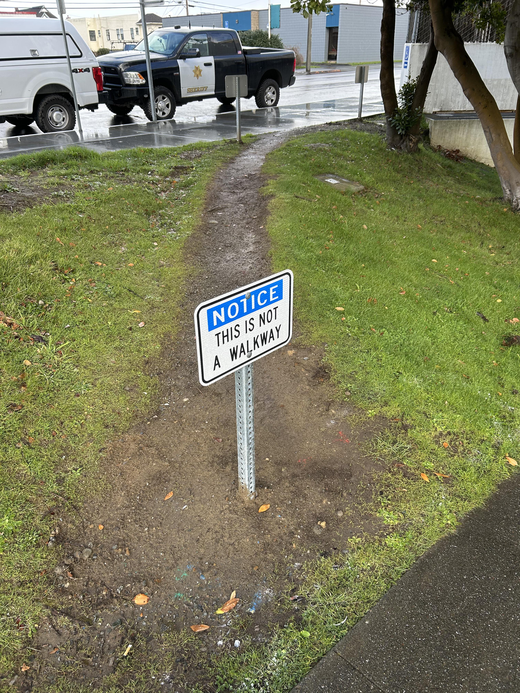
*An example from Reddit user u/Jeffmaster223 on the subreddit r/DesirePath*

Portland is a renowned city for American bicycling. It's among the highest ranking cities in the country for [bike commuting](https://en.wikipedia.org/wiki/List_of_U.S._cities_with_most_bicycle_commuters#cite_note-1) and more than [100 miles of neighborhood greenways](https://www.portland.gov/transportation/what-are-neighborhood-greenways). The Portland Bureau of Transportation (PBOT) compiles the Portland bike network, including these greenways, bike lanes, and multi-use paths, into a handy [Bike Map](https://www.portland.gov/transportation/what-are-neighborhood-greenways) to make navigating the city on a bike as easy as possible.And if you don't have a bike of your own, you can rent one from [Biketown](https://biketownpdx.com/), Portland's bikeshare program.

While it's difficult to get reliable data about people's trips on their personal bikes, Biketown has a large database of where and how Portlanders get around the city on their vehicles. While not desire paths in the traditional sense (no erosion to the physical landscape because these paths were already paved for car traffic), this ridership data can be compared with the Portland Bike Map to see where Portlanders want to cycle, and what gaps may exist in the greenway network. Are there any places where the PBOT could better support Portland's cyclists?

There is a limitation here in that Biketown represents only a small portion of the cycling that takes place in the city, and is more expensive than traditional biking and limited to those with mobile app access, a credit/debit card, and reliable physical proximity to Biketown vehicles. It is also easy to imagine that people who bike regularly (e.g. commuters) may prefer to own their own bikes, whereas Biketown riders may represent more casual bike enthusiasts. This is no doubt skewing the results to some extent. Still, this is the data we're working with.

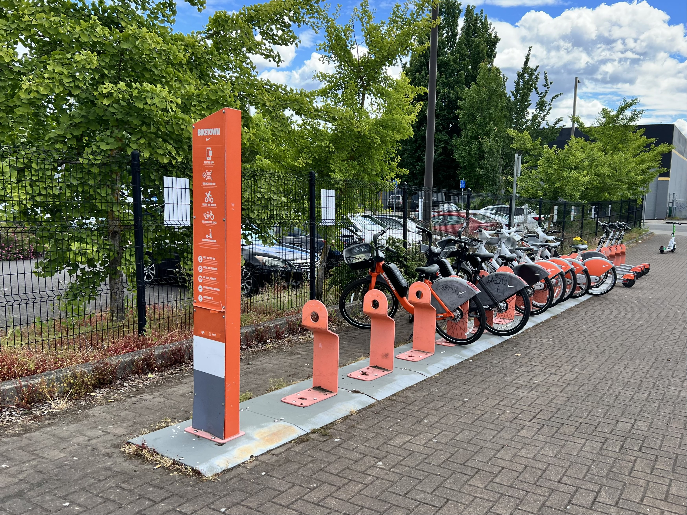
*The Biketown rack at the OMSI MAX station*

## Methodology

This analysis was performed in QGIS. The full workflow was as follows:

1.	Downloaded Q1 2026 rider data from Biketown, the Portland Bike Map shapefile, and Oregon census block groups (links to Data Sources at the bottom).
2.	Cleaned the Biketown route data, removing segments with fewer than 100 passengers or no name. Nameless segments were mostly entrance/exit ramps to primary roads, park trails, or very short connector segments. The only nameless segments I kept from the original data were the Steel and Burnside Bridges, which were both renamed accordingly.
3.	For each segment in the Biketown data, calculate the length of the segment in meters and multiply it by the vehicle count for that segment to determine its total vehicle-meters travelled. Divide by 1000 to calculate vehicle-kilometers traveled. This is the metric we will use for cycling activity in this analysis.
4.	Created an 18m buffer around the Bike Map recommended routes and dissolve these buffers into a single polygon. This was essential for matching streets in the Biketown data with streets in the Bike Map because their respective geometries were not aligned in the raw data. I came to the 18m threshold through trial and error, but it proved to be the ideal width to ensure that all relevant segments in the BikeTown shapefile overlapped with the dissolved Bike Map, while mainaining the Bike Map from spilling over onto adjacent routes.
5.	Translated the Portland census block group shapefile 10m to the north and 10m west. Because census block group boundaries typically divided along roadways, lots of these boundaries overlapped with Biketown segments. I translated the blocks slightly to ensure Biketown segments fit cleanly into a single block group - even if the choice of which was somewhat arbitrary - and to avoid unexpected behavior from these overlaps.
6.	Used the Join Attributes by Location tool to assign the block group GEOID to each Biketown segment shapefile as a new field. I used a one-to-one join with the largest overlap to further reduce the impact of segment-block group overlaps.
7.	Used the aggregate tool to merge the Biketown segments into larger segments based on street name and block group GEOID. Each segment in the new Biketown dataset includes all sections of a given roadway within a given block group, and the summed total of those segments' vehicle-kilometers traveled.
8.	Used the Join Attributes by Location tool again, this time using the buffered Bike Map layer as the overlay, to create a new attribute in the aggregated Biketown segments based on whether the majority of the new segment is located within the Bike Map buffer. This was similarly performed with a one-to-one join using the greatest overlap. This categorizes Biketown-Block Group segments as within the Bike Map network or outside the network, and ensures segments that interest the Bike Map network but are not themselves Bike Map routes are excluded.

##Findings

Overall, Biketown vehicles traveled a collective 5,9972,111 km in Q1 2026, 4,570,064 (76.2%) of which were on routes recommended by the Portland Bike Map.

The heaviest used corridors were downtown and across the six bridges between East and West Portland. This makes sense, given that downtown has the highest transit, population, and Biketown station densities in the city, and the bridges serve as vital connectors between downtown and the geographically larger Eastside of the city. However, downtown also has the highest density of bike routes, and all six Biketownable bridges are recommended cycling routes. This means that most downtown trips were along recommended routes, and the non-recommended routes with the highest bike activity were mostly on the East side.

Below is a list of the ten Biketown segments with the highest number of Q1 vehicle-kilometers traveled that are *not* covered by the Portland Bike Map.

1. SE Division Place from 4th to 9th (20,665 bike-kms)
2. NE 7th Ave from Fremont to Prescott (15,038 bike-kms)
3. SE Division St from 10th to 26th (14,293 bike-kms)
4. SE Caruthers St from 4th to 12th (14,069 bike-kms)†
5. NW 12th Ave from Burnside to Lovejoy (13,919 bike-kms)
6. SW 10th Ave from Salmon to Burnside (12,891 bike-kms)
7. SE Taylor St from Water to 12th (10,926 bike-kms)
8. NE 7th Ave from Knott to Monroe (10,834 bike-kms)
9. SW 12th Ave from Jefferson to Burnside (10,543 bike-kms)
10. NW 21st Ave from Hoyt to Marshall (10,321 bike-kms)

†*This segment of SE Caruthers St is basically a mistake in the data processing. It comprises two separate, disconnected sections, divided by a railroad crossing. The section of to the west of the railroad is a recommended route, and one that I included in the Division/Clinton site visit later on. Most of the cycling on this portion of SE Caruthers St actually took place on this, recommended portion, rather than the longer, non-recommended portion to the east*

The interactive map below shows all road segments in the final dataset. Segments with more bike activity are colored in red, and those with less bike activity are in blue. Zooming in, you can see the Portland Bike Map's recommended routes, which are highlighted in white. Clicking on a road segment displays its name, bike-kms traveled, and whether the segment is a recommended cycling route.

<link rel="stylesheet" href="./resources/ol.css">
<link rel="stylesheet" href="resources/fontawesome-all.min.css">
<link href="resources/photon-geocoder-autocomplete.min.css" rel="stylesheet">
<link rel="stylesheet" href="./resources/ol-layerswitcher.css">
<link rel="stylesheet" href="./resources/qgis2web.css">

    

        
        

    

* * *

## Site Visits

Several road names appeal multiple times in the top 10 list, indicating that the desire paths for bike infrastructure might be longer than the census block boundaries used in this analysis. Even more interesting is that several of these run parallel to a bike path or neighborhood greenway only a block or two away. I spent an afternoon on a Biketown visiting these highly used portions of SE Division and NE 7th, and to compare the experience of riding on these sections of road to riding their adjacent, parallel greenways on SE Clinton and NE 9th.

### SE Divison/Clinton St

It's worth noting that while SE Division has some of the highest non-greenway cycling activity in Portland, the adjacent greenways to these segments see even higher levels of bike activity. This is a very busy corridor in the city. The western edge of SE Division Place is adjacent to MAX lightrail and Streetcar lines, the southern edge of the Eastbank Esplanade and Springwater Corridor trails, the Tilikum Crossing Bridge, and the Oregon Museum of Science and Industry. SE Division Place and Caruthers St serve as essential connectors between these hotspots and commercial corridor on SE Division St, as well as the rest of Southeast Portland.

I began my ride eastbound from the OMSI MAX stop on the non-sanctioned Division Place and Division St to 26th Ave. Once I reached 26th, I returned using the Clinton Street Greenway and SE Caruthers St.

    <table>
	    <tr>
    	    <td style="padding:10px">
        	    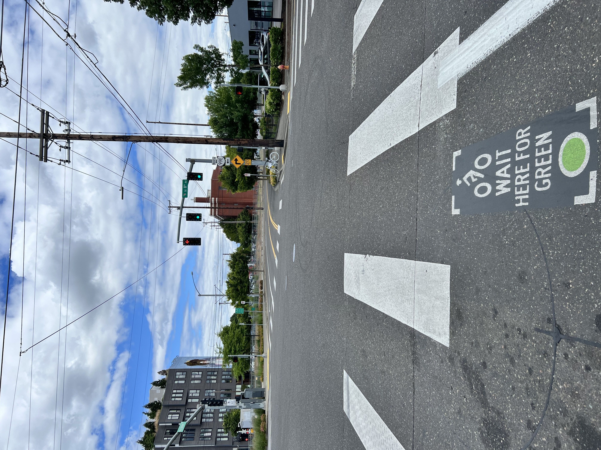
      	    </td>
            <td style="padding:10px">
            	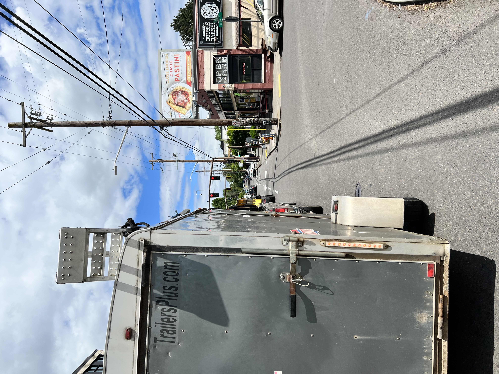
            </td>
            <td style="padding:10px">
            	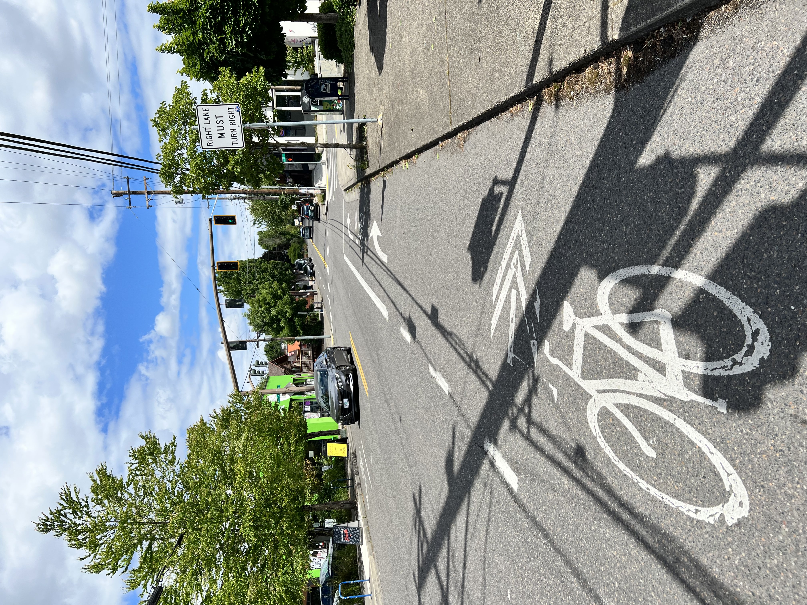
            </td>
        </tr>
    </table>

*SE Division Place/Street*

There was some bike infrastructure on SE Division, and I was not the only cyclist using the roadways that afternoon. As a whole, however, the experience was a bit uneasy. The roads were wide, and there was also lots of motor vehicle traffic that felt like it was towering over me, particularly on the commercial sections of Division St. However, aside from a single bike-arrow at the corner of SE Division St and 21st Ave, I saw no indication that there was a better cycling route a mere two blocks away.

    <table>
	    <tr>
    	    <td style="padding:10px">
        	    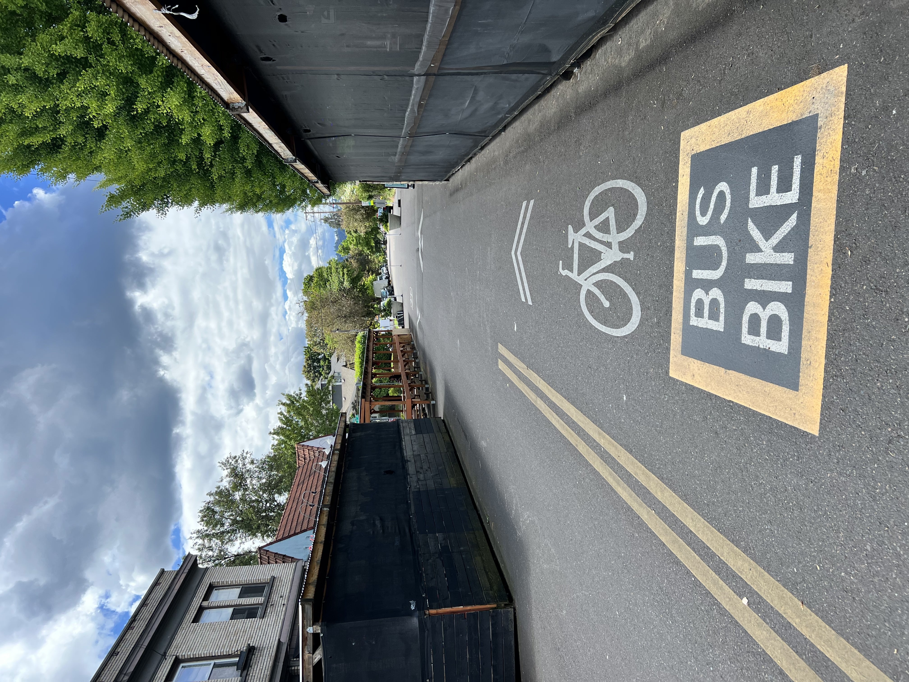
      	    </td>
            <td style="padding:10px">
            	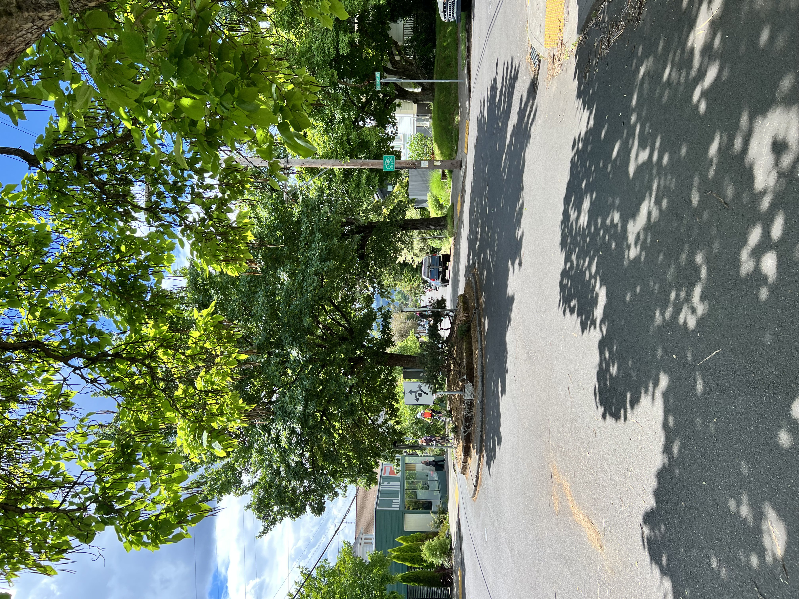
            </td>
            <td style="padding:10px">
            	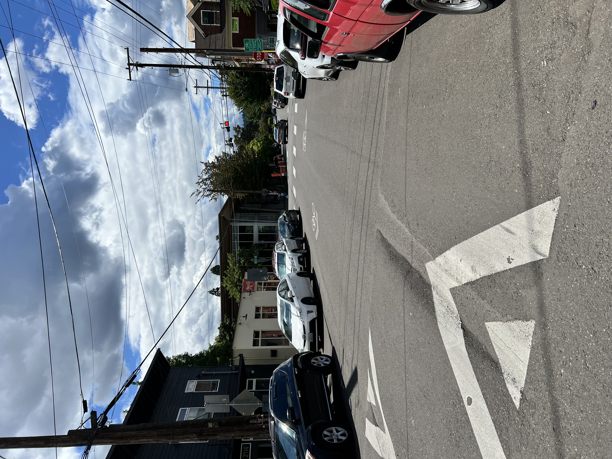
            </td>
        </tr>
    </table>

*SE Clinton St*

SE Clinton St is part of the Portland Bike Bus [LINK!], and riding it was unlike anything I've experience before. Every aspect of the road design led to the feeling that the street was designed for cyclists before any other type of transportation. I passed a variety of different "Bike May Use Full Lane" "Neighborhood Greenway" "Bike Route" signs, as well as obstructions like mini-roundabouts, speed humps (that could be passed smoothly on a bike), and even blockades to prevent cars from using Clinton St as a through street, while bikes could pass through with ease. There was also a clear community involvement in this, as I passed several houses with yard signs advising drivers to slow down on the greenway. As a result, I saw a dozen or so other cyclists using the greenways in just the fifteen minutes I was there on a random Tuesday.

Transferring from Clinton to Caruthers was easy as well, with abundant directional signage directing me mostly off of roadways entirely and onto designated bike trails.

While I am glad that more Biketown users take Clinton as opposed to Division, Division remains one of the most-ridden non-greenway routes in the city. And were it not for my own independent research and planning with the Portland Bike Map, I would have never known that the Clinton St Greenway existed. Given that Division is the more popular commercial corridor it makes sense that many people begin their cycling journeys on Division. The city does a great job of navigating cyclists who are already on Clinton. But there is room for improvement in terms of navigating cyclists off of Division and onto Clinton in the first place.

### NE 7th/9th Ave

These sections of NE 7th and 9th Aves are less trafficked overall, and don't serve any uniquely obvious purpose in the network. And unlike the Division/Clinton section, where most ridership took place on the recommended route, NE 7th sees significantly more bike activity than the adjacent greenway route on NE 9th. I rode southbound on NE 7th from Alberta St to Knott St, and returned to Alberta on 9th, to see why.

    <table>
	    <tr>
    	    <td style="padding:10px">
        	    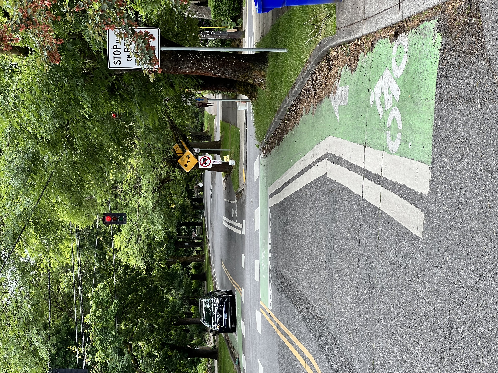
      	    </td>
            <td style="padding:10px">
            	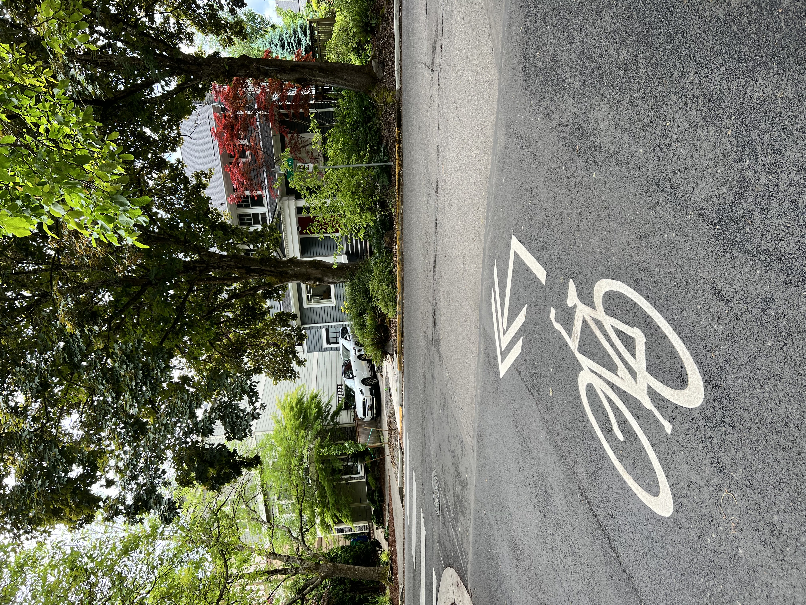
            </td>
            <td style="padding:10px">
            	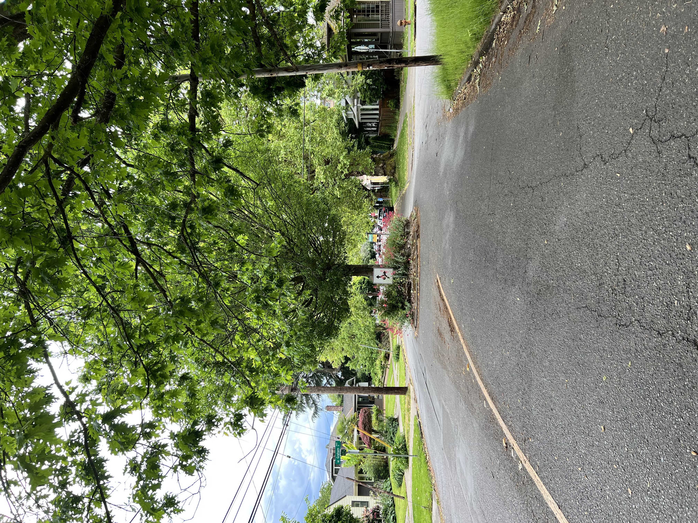
            </td>
        </tr>
    </table>

*NE 7th Ave*

While this area had fewer riders than the SE corridor, I wasn't the only one biking on 7th Ave while I was there, and far fewer cars. The road was narrower than Division and Clinton, with parked cars on both sides and speed humps on nearly every block north of Fremont (these speed humps did not have cutouts for easy cycling). That said, there was some limited bike infrastructure, including a short painted bike lane to help with crossing Fremont S and a mini roundabout for traffic calming. There was even a painted bike arrow at the intersection with Siskiyou St, directing bikes onto southbound 7th.

    <table>
	    <tr>
    	    <td style="padding:10px">
        	    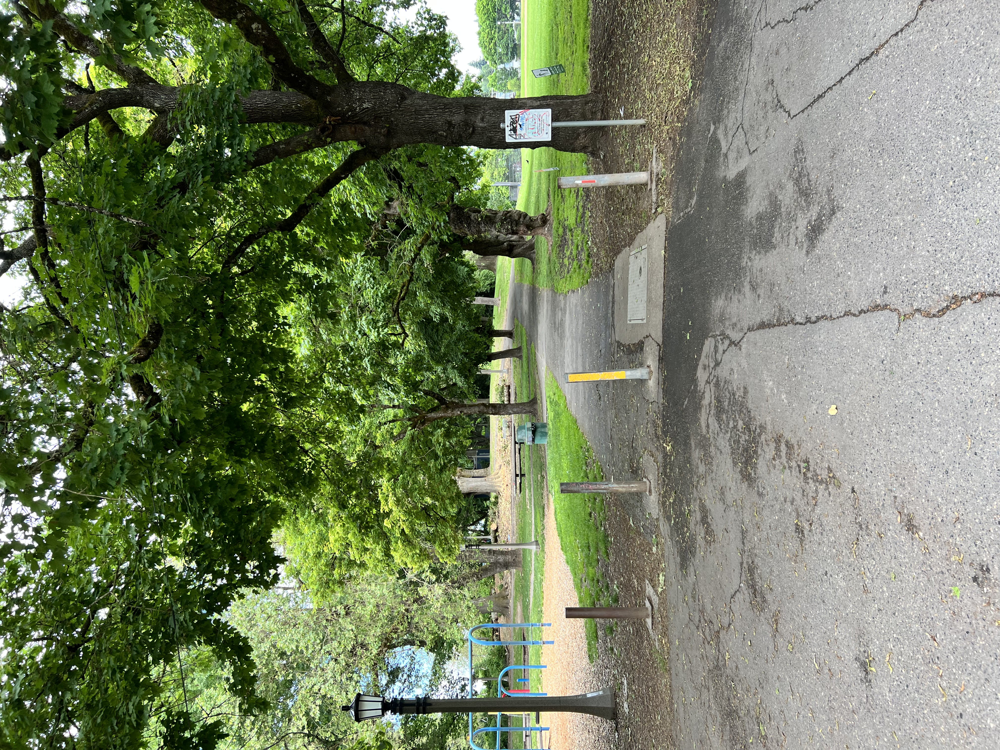
      	    </td>
            <td style="padding:10px">
            	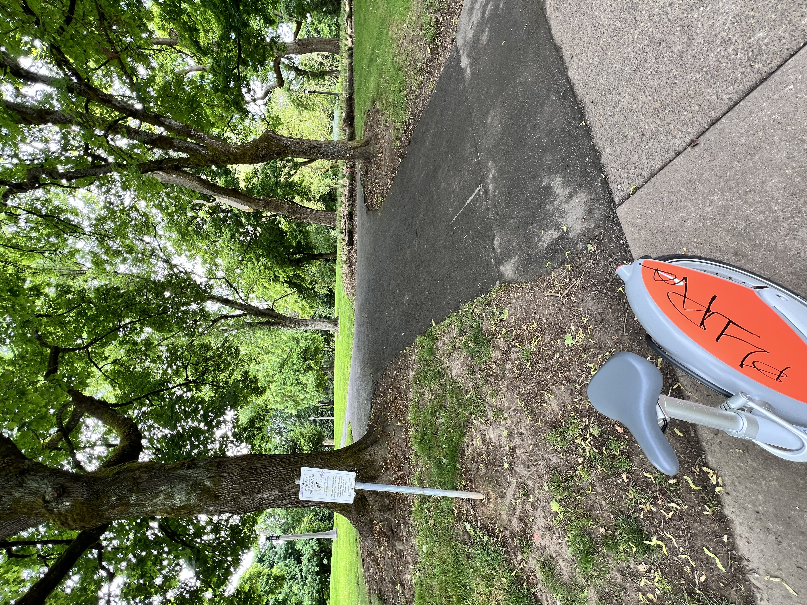
            </td>
            <td style="padding:10px">
            	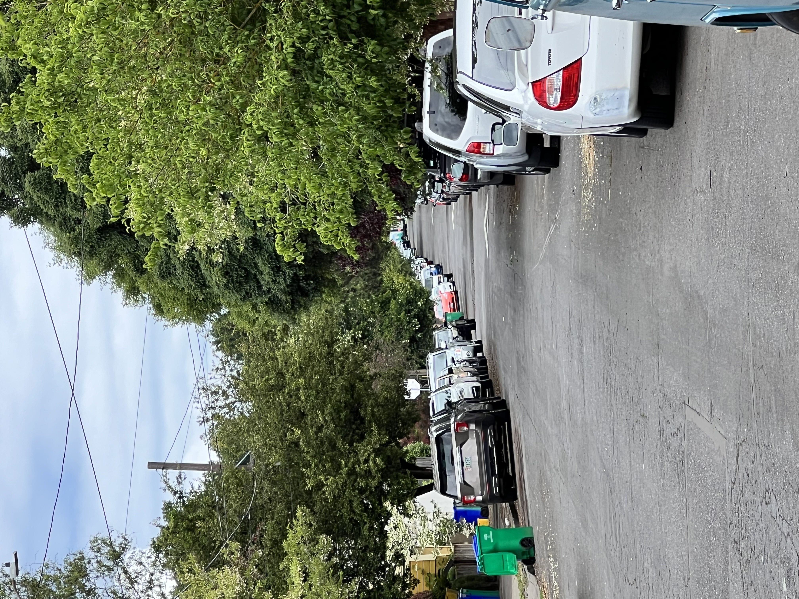
            </td>
        </tr>
    </table>

*NE 9th Ave*

In general, 9th has a very similar character to 7th - narrow neighborhood streets with lots of parked cars and speed humps. However, the bike infrastructure was actually more limited on 9th. There were no mini roundabouts, no bike lane when crossing Fremont St, and there was a significant barrier to easy riding in Irving Park. The only physical indication I saw that I was on a neighborhood greenway at all was the bicycle design above the stop signs. I did not see anyone else cycling on 9th while I was there.

While on paper it may seem wise to route a greenway through Irving Park, it actually proved to be a fairly significant barrier. The park's trails are quite narrow, as they were designed primarily for foot traffic, and I found it difficult to maintain an appropriately slow speed on a e-bike to navigate these trails (and the accompanying pedestrians walking their dogs) safely. In comparison, the surrounding neighborhood streets see quite little car traffic, and the cars that are already moving slowly as they maneuver the area's many speed humps, narrow streets, and parked cars. The northern end of the park's trail also has a short section that was much too steep to comfortably.

Given the differences in infrastructure between 7th and 9th, I think it makes sense and is probably safer for cyclists to continue routing through 7th, as opposed to 9th. It is also worth noting that just south of where I ventured, NE 7th is a recommended cycling route and extends to the Blumenauer Bicycle and Pedestrian Bridge, which serves as a vital connection between Northeast and Southeast Portland over US Interstate 84. Under the current bike network, northbound cyclists crossing this bridge are advised to go out of their way to travel on roads that are less conducive for biking than where they started. This is a situation where the city's Bike Map does not seem aligned with the true cycling conditions on the ground.

## Conclusion

While most Biketown activity takes place along routes recommended in the Portland Bike Map, nearly a quarter takes place on unprotected roadways which could put cyclists in unnecessary danger. For this project, I visited the two most popular non-recommended cycling corridors, along SE Division and NE 7th, to understand why cyclists may diverge from recommended routes. In the case of Division, most of the area's bike activity does take place on the nearby greenways on Clinton and Caruthers Streets. But given the commercial popularity of Division, and the lack of signage directing cyclists from nearby streets towards the greenway, a sizable chunk remain on Division. In the case of 7th, this road is actually better suited for cycling than the designated greenway on 9th. This portion of 7th includes mini-roundabouts for traffic calming and a short bike lane to assist with crossing NE Fremont St, whereas nearby 9th does not have such assets and awkwardly and dangerously cuts through a popular park. While not a desire path in a traditional sense, this section of 7th sees more ridership than nearby 9th, and I would argue that this is a situation where the bike network as a whole would be improved by following the popular cycling demand.

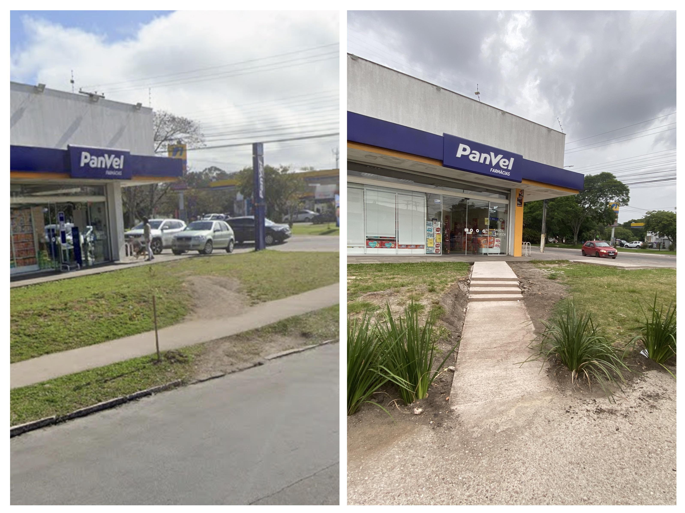
*A desire path becomes reality. From Reddit user u/DownDeep99*

## Data Sources
- [Biketown Ridership Data - Downloaded for Q1 2026](https://public.ridereport.com/pdx?x=-122.6411937&y=45.5228353&z=11.23&vehicle=e-bike)
- [Portland Recommended Bicycle Routes](https://atlasdata.dartmouth.edu/downloads/supplemental#boundaries)
- [Biketown Service Area Boundary](https://gis-pdx.opendata.arcgis.com/datasets/d4edce3b82d441ff8f621d07a21eb11f_1301/explore?location=45.535874%2C-122.566732%2C12)
- [Oregon Census Block Groups 2020](https://geohub.oregon.gov/search?q=block%20groups)

[back](../)
