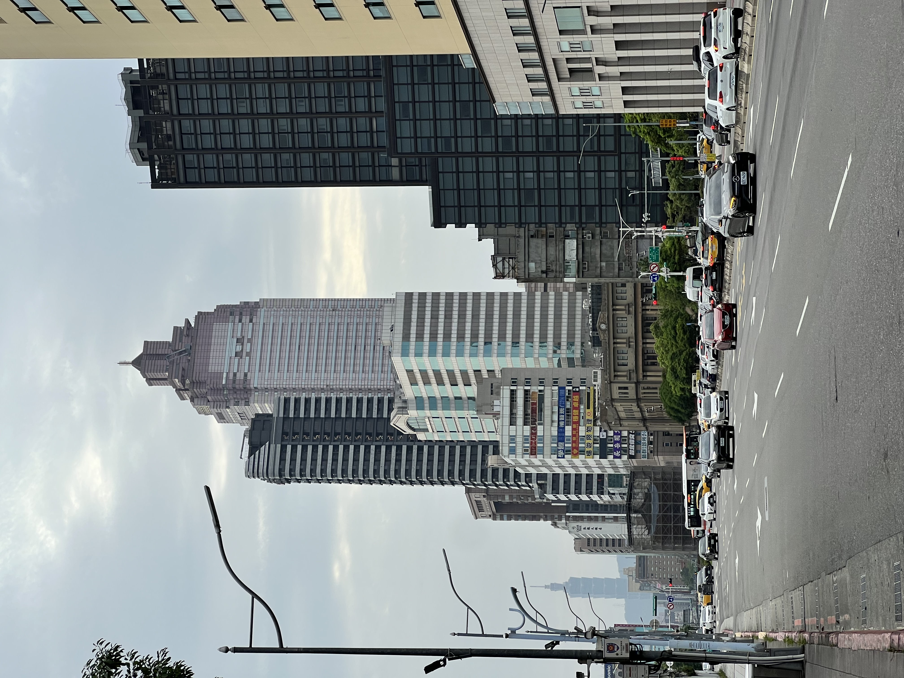
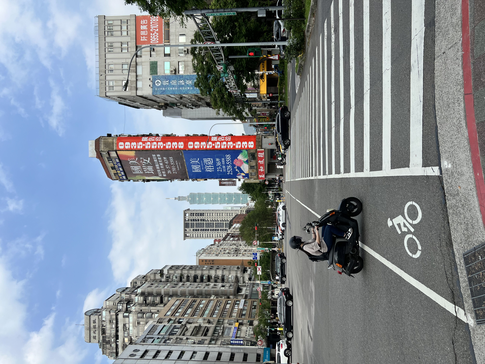
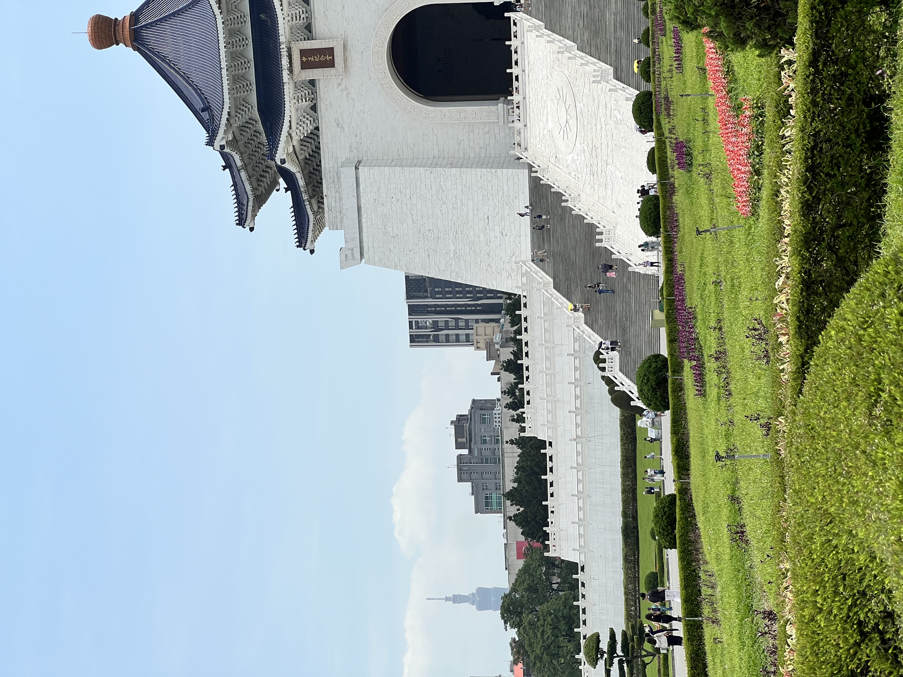
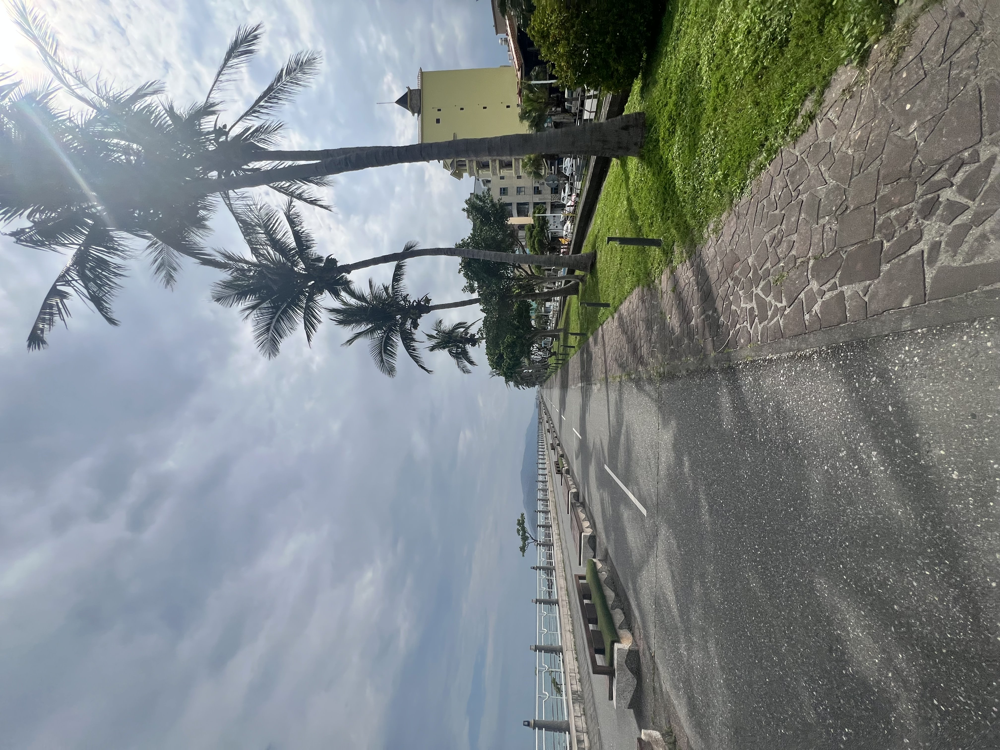
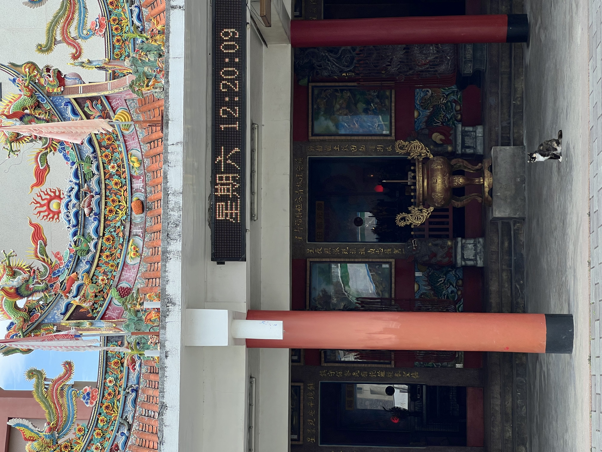
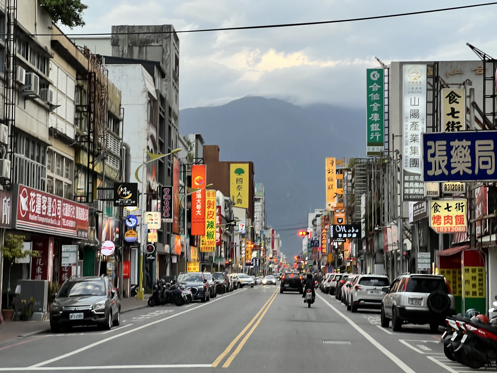

Shortly after the trip, while my memories were a bit fresher, I wrote a piece <a href="https://jmumps.substack.com/p/shazaming-the-streets-of-taiwan" target="_blank">on my Substack</a> about the songs I heard while out and about. Check it out for some good tunes and some WORDS.

## Day One and Hualien

I landed in Taoyuan on an April evening and took the train to Taipei. I booked a hostel close to the main train station for my first two nights, which gave me my first full day in Taiwan to explore the city. I woke up early (around 5:30 because of jet lag and a remarkably early sunrise) and logged probably 35k steps that day. I explored Datong and Ximen, had a scallion pancake for breakfast, meandered to the Botanical Gardens, Chiang Kai-Shek Memorial, and eventually all the way out to Taipei 101.

Taipei 101 was the tallest building in the world at the time of its construction, though today it sits just outside the top 10. Still, it's an impressive sight, visible from basically the entire city and noticeably taller than every other building in the city (which are also quite large). Its lower floors are mostly a luxury shopping mall with a large food court. The upper floors include an observatory deck, but I decided to hold off on those until later in the trip. I took the metro back to my hostel and took a nap.

    <table>
	    <tr>
    	    <td style="padding:10px">
        	    
      	    </td>
            <td style="padding:10px">
            	
            </td>
            <td style="padding:10px">
            	
            </td>
        </tr>
    </table>

*Three pictures from my walk. Notice a familiar figure in the background?*

The next day I took the train to Hualien, a city on Taiwan's eastern coast and a hub of indigenous Taiwanese culture. It's also close to Taroko Gorge, one of Taiwan's most popular national parks. Unfortunately, the park was still mostly closed as a result of earthquake damage when I was there, so I didn't get to see it.

I stayed two nights in Hualien at World Inn hostel, near the train station. For my first night, I had two goals - touch the ocean and have indigenous Taiwanese food at Dongdamen Night Market. With a tasting of local millet wine (alongside some delicious friend enoki mushrooms and okay clam soup), I accomplished both.

The next day I rented a bike from a nearby shop and rode 30km around the city. I passed by a temple, farms some gorgeous beach trails with incredibly stackable rocks, and the Taiwan Aboriginal Culture Museum. The museum was small but had some interesting and Google Translatable info about indigenous culture on the island.

    <table>
	    <tr>
    	    <td style="padding:10px">
        	    
      	    </td>
            <td style="padding:10px">
            	
            </td>
            <td style="padding:10px">
            	
            </td>
        </tr>
    </table>

*Three pictures from my walk. Notice a familiar figure in the background?*

That afternoon I explored the city more on foot. I got some boba and walked Ziyou Street to the Hualien Cultural and Creative Industries Park. After walking around for an hour or so, I realized I left my water bottle on the bench where I sat to drink my boba. It was still there when I went back for it. It struck me how secure I felt in Taiwan with regard to theft and crime. I even left my bike unlocked around town and it was completely fine, which would have never happened in the US. I don't remember if I had a lock or not, but either way it didn't even seem necessary. I bought some souvenirs that night, had another meal at the night market (this time some mapo tofu and corn on the cob on a stick dipped in sauce) and took the train back to Taipei the next morning.

## Meeting with Evan and heading South

## Kaohsiung and Tainan

## Fenqihu and Day Trips

## Back to Taipei

[back](../)
