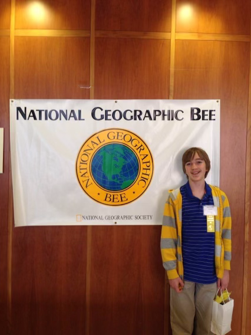

# Queer in the Ears: Taraz Part 2

While my experience in Taraz was the most jarring encounter I had with homophobia while traveling, it wasn't the first.

The first was on a summer afternoon in Tbilisi, Georgia. As I walked up to my favorite cafe to order an iced coffee with ice cream and spend the afternoon writing about [ruderal gardens](https://urbanassemblage.iliauni.edu.ge/jackson-freeman-mumper-2/), I noticed a group of about 30 people gathered outside. Many of them were carrying signs, and they were surrounded by police, who were monitering the situation to make sure things didn't escalate. There had been protests and rallies all over Tbilisi since [the day I landed](https://www.euronews.com/2022/06/20/georgia-tens-of-thousands-rally-in-tbilisi-to-demand-eu-membership), so I ventured into the crowd to see what was going on. Maybe another pro-EU demonstration. I peered over the signs, most of which were written in Georgian, until I found one that I could read.

> "LGBT diplomats, keep your filthy hands off our children"

I turned around to find a different cafe.

About a week later, Diana, our internship coordinator, organized us a Saturday morning excursion to the Georgian National Museum, a grand complex of exhibits illustrating Georgian history dating back to before evolution of humankind. After spending a couple hours inside, we exited the museum and to see a line of police officers across the city's main Rustaveli Ave. Looking past them, we saw they were overseeing a much larger political gathering outside the Parliament Building that spilled out into the streets across the whole block. Curious about the commotion, me and two of the other interns made our way into the crowd to get a better look. The crowd skewed middle-aged and overwhelmingly male. One man stood on the parliamentary steps, giving a speech in Georgian to the crowd. After about 30 seconds of looking, I found a sign in English. Written on it was the same line about LGBT diplomats and children. I turned to the girls I was with, who had already noticed the gender-skew of the crowd and the men gawking at their legs under their shorts. The three of us made knowing eye-contact and left.

*Georgian Parliament at night*

Despite these outward displays of hostility, of all the cities I visited in the former USSR, Tbilisi was probably the most gay-friendly, and certainly where I felt the most comfortable. The biggest reason for this was the support and community I had there. All three of us who stumbled into the demonstration were queer, and ARISC, the organization sponsoring our fellowship, made explicit their commitment to fostering a safe program for us. In addition, Tbilisi has a small but visible LGBT community. It's not uncommon of to see a rainbow flag in a window in Tbilisi, or to walk past someone wearing a pride accessory. The city has even tried to host pride parades, though these have [ended](https://www.bbc.com/news/world-europe-66145898) rather [tragically](https://www.bbc.com/news/world-europe-57720366). In my eyes, the backlash to LGBT rights is almost a sign of progress. The protest outside the cafe was sparked because they had hung a rainbow flag in their window. Without shifting attitudes and political progress, reactionary counterprotests would be pointless. So while it's upsetting to see so much violence toward the LGBT community as is in Tbilisi, one thing that everyone can agree on in Tbilisi is that gay people exist, and are a force of change.

After my six weeks in Georgia came to an end in late July, and I made for Central Asia, I was suddenly very alone, without queer friends or institutional support, and in a political context where queer rights are much more obscure than in  Tbilisi. My first stop in Central Asia was Astana, Kazakhstan's capital and second largest city, which has been built nearly from scratch in the steppe over the last 30 years. In Astana, I befriended two guys, Rayim, who worked at my hostel, and Ruslan, Rayim's friend, who happened to be gay. The three of us rented a paddleboat on the river and drank kymyz (fermented mare's milk). I asked Ruslan about being gay in Astana and he told me that it really wan't a challenge these days. I was a bit skeptical of this answer. I'd spent several hours doomscrolling through articles about discrimination, censorship, police brutality, extortion, and more in Kazakhstan's gay community. But I tried to keep an open mind - nobody writes articles about gay people living happy lives. Ruslan discolsed his sexuality very soon after meeting me, which indicated at least some comfort in being publicly queer, and Rayim clearly didn't mind being the only straight person in the group (something I've found straight men even in the US struggle with). Rayim had to work early the next morning, and left Ruslan and me alone for the evening. Ruslan mentioned that he frequented city's underground gay bar, and curious what a Kazakh gay bar would be like, I asked to go. We called a taxi to the address, and arrived to a nondescript building in an unassuming part of the city. The street was poorly lit, there was no music or people, no signs of nightlife and certainly no pride flags. From the street, it looked like any other desolate post-Soviet commie block. We walked up to the door to press the buzzer and request entry, only to realize that it was Tuesday, and they were closed. We turned around, dejected, and went our separate ways for the evening. Two days later, I left for Taraz.

    <table>
	    <tr>
    	    <td style="padding:10px">
        	    
      	    </td>
            <td style="padding:10px">
            	
            </td>
            <td style="padding:10px">
              
            </td>
        </tr>
    </table>

*Astana*

I only encountered outspoken homophobia once after I left Taraz, at a taxi stand in Bishkek. It was late September, and I was making my way south to Jalal-Abad, with plans to see the Arslanbob walnut harvest before heading to Uzbekistan. The road to Jalal-Abad was too mountainous for the marshrutkas to handle, so I instead found a taxi stand at the bazaar that was sending vehicles. I paid the fare for one seat, and got to chatting with the middle-aged man directing the taxi stand while I waited for other passengers to arrive. We chatted in Russian, and he asked all the standard questions: where I was going, where I learned Russian, what I thought of Kyrgyzstan. Then, without a change in tone, he pointed at my ears and told me that I didn't need my earrings because people would think I was голубой - gay. My heart started pounding, and I felt flustered. I tried to explain that this was normal in the US. That lots of American men, gay and straight, wear earrings and it hasn't been an indication of a man's sexuality since before I was born. But he wasn't having it, and insisted that I needed to take them out so people wouldn't think I was a homosexual. After going back and forth a bit, I walked away to collect my thoughts. My anxiety was still intense. I felt like I'd suddenly been transported back to Il'yas's backyard and I worried about whether the taxi director somehow knew I was gay, and if he was secretly plotting against me. Maybe they'd deny me service to Jalal-Abad. Maybe they'd convince the whole minivan to drive me out to a desolate location and abandon or murder me there. I walked back to the taxi 30 minutes later, with a pit in my stomach, only to find that they'd filled the other seats and were waiting for me to get back. I climbed inside and the taxi left with me and seven or eight Kyrgyz folks, as well as a very chatty Uzbek man who invited me to stay at his house in Andijon that evening (I declined). I settled into my seat and the amazing views of the lakes, valleys, and ridges of the Tian Shan passing by the window let me forget about the ordeal. I arrived safely in Jalal-Abad that night.

*The taxi stand guy also said that I didn't need a mustache, because it made me look 40*

Guarding my sexuality proved to be one of the most exhausting parts of traveling. I was fortunate growing up that I never had to worry about the closet. I first realized I wasn't straight when I was 13, and came out to my inner circles within a month. My parents have always been supportive of me, as were my friends in school. Then I went to Middlebury, a notoriously progressive liberal arts college in Vermont. Before Central Asia, the closest I'd been to a closet were the 10 weeks I spent in Uganda in 2021. But like when I was in Georgia, I spent most of my time there with American college students and under the protection of a progressive NGO that made its pro-LGBT stance quite clear. Central Asia was the first time in my life I've defaulted to presenting myself as straight, or even allowed people to make that assume that I was. I felt often like an imposter, knowing that people would treat me differently if they knew my sexuality. Whenever I met someone I had to risk either brunting potential homophobia head-on, or protecting myself by putting up a shield. The shield kept me safe so I almost always went that route, but it hindered my ability to connect with people. So many conversations one has with strangers are about family, dating, and marriage, and I couldn't participate. I always felt like I was hiding a piece of myself from strangers, who welcomed me always with such genuine warmth. Sometimes I felt like a leech, extracting these connections and warmth without offering my own. Sometimes I felt guilty that I was assuming that people would be hateful in the first place, and wasn't even giving them a chance.

Later that week I arrived in Arslanbob, a mountain village in ethnically-Uzbek southern Kyrgyzstan next to the world's largest walnut forest. I met Hayat, the director of the local Community Based Tourism (CBT) office. He connected me with a homestay, and scheduled a guided tour of the forest for the next day. I dropped my stuff off at my host family's house, and eager to move my body after a long travel day, I went out on a hike to the Big Waterfall. It took me about an hour to get to the top, and after spending a brief moment watching the falls, I turned around and walked back to the homestay for dinner. On my descent I passed a group of school boys. They were very excited and curious to see a tourist, and came running up to me to ask questions. They showed off their impressive English skills (challenging phrases like "Hello" and "How are you?"), and asked me some questions in Russian to figure out who I was and what I was doing in Kyrgyzstan. I'm not very good with kids, but I chatted with them for a bit, answering their questions. I'm always excited to get some Russian practice in. Then, one boy got a surprised look on his face and let out a gasp. He asked me a question I didn't understand, and I shook my head. Frustrated I wasn't getting him, he tried charades. He pointed at me, pointed toward his ears, and asked 'почему (why)?

    <table>
	    <tr>
    	    <td style="padding:10px">
        	    
      	    </td>
            <td style="padding:10px">
            	
            </td>
            <td style="padding:10px">
              
            </td>
        </tr>
    </table>

*Arslanbob - homestay, waterfall, and walnuts*

In retrospect, this kid seemed genuinely curious. He grew up in a remote village in Kyrgyzstan, probably with no internet access and few opportunities to leave his community, let alone to somewhere remotely cosmopolitan. One of Hayat's main goals with his CBT branch is to promote cultural awareness between his neighbors in Arslanbob and the rest of the world and he's done great work. There were maybe a dozen or so different tourists in Arlsanbob during my five-day stay there, and our host families all seemed to benefit from the extra income and English practice. But Kyrgyzstan is far from a tourist hotspot, and Arslanbob is off the beaten trail even by Kyrgyzstan standards. Plus, this kid couldn't have been any older than 9. Covid had decimated tourism across the world, including in Kyrgyzstan, when we was barely old enough to start school. He might not have seen any visitors since he was 6, if ever. And would he even have remembered visitors from when he was that young? So now, here I am, a white guy with pierced ears wearing a bright red t-shirt. I look obviously different than any Central Asian man he'd met, and kids are curious people. He wanted to know more. Why was I dressed in such an outlandish way? This could have been a good moment to teach tolerance, and do my part to promote cultural awareness. I could have explained to him and his friends that in the US, men do wear earrings. And that there's nothing wrong with dressing however you want to dress. But my familiarity with this question, combined with the ear-pointing and the Russian dialogue, gave me flashbacks to Taraz and Bishkek. In a panic, I shrugged, pretended I didn't understand what he was asking, and went back to my walk.

I had dinner at my homestay that night with a lovely straight couple from the States, Iulia and Aseef, who were in the early stages of their year-long travel journey. Aseef wore one earring and a nose-ring. Curious how unique my experiences had been, I asked him if he'd encountered any hostility because of his piercings. He laughed and told me about a taxi ride he'd shared with an older man who was very upset by his piercings, repeatedly gesturing for him to rip them out while the other passengers grew agitated by the old man's volume and preachiness. I realized as he talked that this experience didn't seemed to phase him. He told the story lightheartedly, as though he was recounting ordering the wrong item in a restaurant. Just another hiccup of culture shock. Maybe my anxiety wasn't just that people would think I was gay, but that they'd be correct. I told Aseef and Iulia about my earring experiences - the Taraz workaway, the Bishkek taxi stand, and the kid from that afternoon - trying, but probably failing, to maintain the same unaffected posture. The response I got was not the chuckle I'd hoped for, but concerned looks, and Aseef asked me why, given the risks that came with being LGBT in Central Asia, I had wanted to visit at all.

*Jackson in 2014*

I hadn't considered this before, and I was a bit flustered when I tried to answer. But in retrospect, this question reframed how I approached my journey. I didn't want the story of my time abroad to focus on my personal struggles as a gay American, and the awful times I dealt with homophobia in this terrible place where I'm *illegal*. Shocking: affluent white guy travels to Asia to experience a different culture, and the culture is different than he's used to! I did my research and I knew the risks before I left. And I'm grateful I was able to take these risks and still be reasonably certain of my safety (if things got bad, I'd have just gone home). After I took a moment to collect my thoughts, I told Aseef that despite the risks, I wasn't going to let my sexuality stop me from exploring a place I've dreamed to visit for nearly a decade. That's about as long as I've known I was gay to begin with. And as I pondered this question more over time, I realized that if I were to write off the whole region as some sort of homophobic dystopia, it would be a disservice to Ruslan and the other queer friends I'd made in Central Asia, as well as the people and organizations working to make their communities more inclusive. No culture is a monolith, and despite being generally queerphobic, Central Asia has queer subcultures that deserve recognition and support.

My primary goals for travel are always to have fun and try new things. But on a multi-month adventure, I found it useful to have some side quests. One of these was to get better at Russian. But as time passed and I had more experiences that challenged how I view my queerness, I developed another side quest: to spend some time around gay people and in gay spaces. This was partly a survival mechanism, but also a curiosity about what queer culture looks like in a such repressive context. Are their lives as miserable as Google searches make them out to be? How do they find each other and build community?
