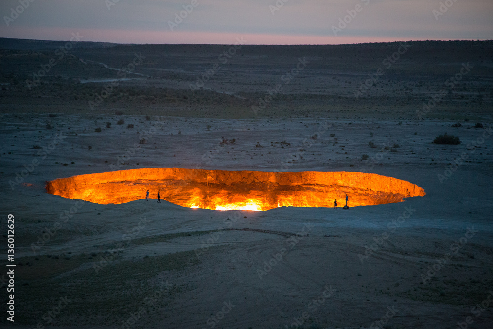

# Prologue: Where I've Been, and Why I've Been There

In the fall of 2019, I began my sophomore year at Middlebury, which meant it was time to choose a study abroad program. Not everyone at Middlebury studies abroad their junior year, but it’s quite common, and I had been looking forward to my semester abroad since before I was even in college. I had just finished an incredible summer internship in Peru, and wanted to improve my Spanish, so I Latin America was the place to be. After a meeting with the college’s study abroad advisor to Latin America (study abroad is so popular at Middlebury there are four different advisors for it), I decided to do my program away in beautiful Buenos Aires during the great semester of fall 2020.

For obvious reasons, that never happened. When the pandemic started and I was at home, I had two emotions: I was bored, and I was anxious. I was bored without my friends, clubs, and hobbies, and I was anxious about the state of the world and my long-anticipated semester abroad. I started to browse Google Maps, Google Flights, and several travel blogs in my free time, hoping that I could go somewhere soon, be it to Argentina or elsewhere. And to alleviate my boredom at my childhood home, I started reconnecting with some of my old interests from middle and high school, including an interest in Central Asia.

In 7th and 8th grade I also spent my free time staring at maps, only then I was studying for the geography bee. One day, a student teacher in my social studies class made an off-handed remark that Turkmenistan was no longer a country right before we were assigned to select countries in Asia to prepare presentations on. In the interest of being a smartass, I presented on Turkmenistan. During my research, I was fascinated by the country. Then over time, my interest in Turkmenistan grew into an interest in Central Asia as a whole - a region with several countries with funny names ending in -stan that most Americans have scarcely heard of. As I learned more about the unique mix of cultures that have influenced Central Asia into what it is today, nomadic shepherds, Islam, Silk Road trade routes, and most recently the USSR, I found myself particularly interested in the region. But when my geobee days came to a close, I largely forgot about it.

*Turkmenistan, which was difficult to enter anyway, was still completely closed due to covid in 2022*

Flashforward back to the pandemic, as my curiosity about the world is at an all time high, I’m rediscovering staring at maps or hours on end, and with that returns my interest in Central Asia. I’m feeling bored and purposeless, and I come across a YouTuber called [Ikenna](https://www.youtube.com/watch?v=Qbpxal0i_5w), who speaks far too many languages, declaring that the pandemic is the perfect time to learn a language. Following my curiosity, need for purpose, and need of something to do, I decide to start learning Russian, the lingua franca of Central Asia, just in case I got there some day.

I continued my Russian study back at Middlebury. I also found ways to incorporate my interest in Central Asia into my geography classes. And as I approached my senior year, I applied for the prestigious Princeton in Asia Fellowship. During this application process, I made a [one minute video](https://drive.google.com/file/d/1E9BwuGm14PYY5RVunE7AxvnUpZfpxQnr/view?usp=sharing) explaining why I would be the perfect candidate for a fellowship position in Kazakhstan - about which I had read a book that included a not-insignificant amount of Kazakhstani propaganda. I was not selected for the fellowship. But I was selected for the summer [Experience the South Caucasus Fellowship](https://arisc.org/events/experience-the-south-caucasus-fellowship/), which landed me a one-month position in Tbilisi, Georgia from mid-June to mid-July, including accommodation, a daily living stipend, and airfare reimbursement. In addition, my college choir was set to go on tour in Morocco and Spain immediately following graduation (more on that in another story). After the choir tour but before the fellowship I had a one week break, which I figured was too short a time to fly back to the States and return to Europe, so I opted to visit Lisbon instead. And finally, after staring wistfully at Google Maps and considering how close to Central Asia I would be during my fellowship, I realized:

> “You know what? I don’t have a job. I have time. And I’ve always wanted to visit Central Asia. I know some Russian already. Let’s just go now.”

I asked the folks at ARISC, the organization sponsoring the Georgia fellowship, if they could reroute my return flight to Astana, Kazakhstan. After a bit of explaining, they agreed.

At the point I left the States, that was as much of my trip as I had planned. I had a vague idea of the places I wanted to visit in Central Asia, and an even vaguer idea that I might go to Southeast Asia after I was ‘done’ in the -stans. But only time would tell how things would unfold.

---

Here’s how things unfolded:

Country | Days | Total Days | Cities
Morocco 🇲🇦| 7 | 7 | Marrakech, Rabat
Spain 🇪🇸| 5 | 12 | Sevilla
Portugal 🇵🇹| 6 | 18 | Lisbon
The Netherlands 🇳🇱| 1 | 19 | Amsterdam
Georgia 🇬🇪| 25 | 44 | Tbilisi, Lagodekhi, Qazbegi
Armenia 🇦🇲| 3 | 47 | Yerevan
Georgia 🇬🇪| 12 (37 total) | 59 | Tbilisi, Sighnaghi, Gori
Kazakhstan 🇰🇿| 28 | 87 | Astana, Taraz, Almaty
Kyrgyzstan 🇰🇬| 39 | 126 | Bishkek, Karakol, Osh, Jalal-Abad, Arslanbob
Uzbekistan 🇺🇿| 24 | 150 | Fergana, Tashkent, Samarkand, Bukhara, Khiva, Nukus
Kazakhstan 🇰🇿| 4 (32 total) | 154 | Aktau
Azerbaijan 🇦🇿| 7 | 161 | Baku, Quba
Kazakhstan 🇰🇿| 9 (41 total) | 170 | Shymkent, Turkestan, Almaty

Thank you for reading my page. I’m excited to share with you some of the stories, places, and people that made this adventure happen.
